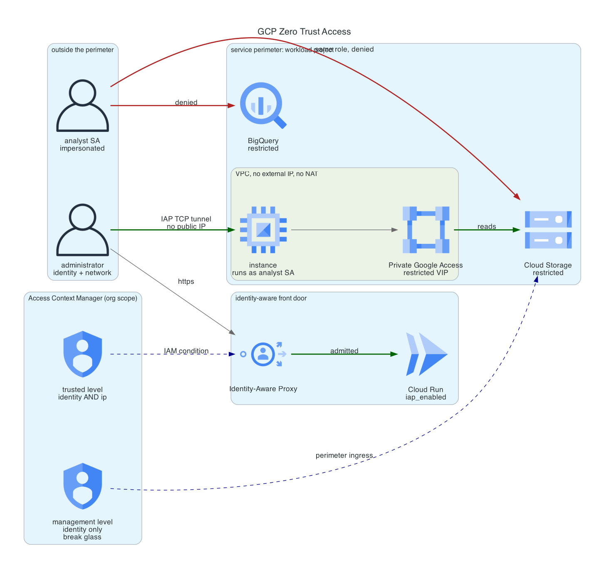

# GCP Zero Trust Access

A valid credential is not access. A service account holding `roles/storage.objectViewer`, granted on purpose and scoped to exactly one bucket, reads the object from inside the perimeter and is refused from outside it. Same identity, same role, same object, different origin.

The demo is that comparison, plus the front door it sits behind: an application reachable at a public URL that no unauthenticated request ever reaches, and an instance with no public address, no NAT, and no SSH key anywhere.



**Cost:** under $1 for a full deploy, demo, and destroy cycle. Standing cost if left up is about $6 a month, nearly all of it one e2-micro instance. Access Context Manager, VPC Service Controls, and IAP are free. **Teardown:** three things live at the organization, not in the project, and outlive it. All handled by `scripts/destroy.sh`, all documented below.

## The problem

Identity and Access Management answers one question: may this principal perform this action on this resource. It answers it well, and it is not sufficient, because the question it cannot ask is whether the request should be happening at all.

A stolen credential is a valid credential. That is the whole difficulty. Every control that reasons only about who is asking will approve it, because by construction the answer to "who is asking" is "someone entitled to ask". The credential was scoped correctly, the role was granted deliberately, and none of that helps.

The network perimeter used to be the second question. It stopped working when the resources moved to APIs on the public internet, because the boundary no longer corresponds to anything: a Cloud Storage bucket has no inside.

So the second question has to be reconstructed at the API, and that is what these three services do together. Access Context Manager defines what a trusted request looks like. IAP evaluates it at the front door, per request, before the application is reached. VPC Service Controls evaluates it at the data, and refuses to let bytes cross the boundary regardless of what IAM says.

## How GCP differs from AWS and Azure here

This is the point of building it on GCP specifically. Two of these three have no honest equivalent elsewhere.

**VPC Service Controls has no counterpart.** This is the strongest claim in the repo and it is worth being precise about. AWS has pieces that overlap: `aws:SourceIp` and `aws:SourceVpce` conditions on a bucket policy, plus VPC endpoint policies, plus SCPs with a data perimeter condition set. Assembled carefully, they approximate it. The difference is where the rule lives and what it defaults to. On AWS the boundary is expressed as conditions written into each resource's policy, so a bucket created without them is outside the perimeter and nothing announces that. On GCP the perimeter is an object that contains projects, and a resource created inside a project is inside the perimeter from the moment it exists. The default for a new resource is protected rather than exposed, and that inversion is most of the value. Azure has no comparable construct at all; Private Link and service endpoints restrict network paths to a resource, which is a different and weaker claim than restricting data movement across a boundary.

**Access levels are named objects, not policy text.** An IAM condition here references an access level by name. The equivalent on AWS is an `aws:SourceIp` condition written inline in the policy, which means the definition of "trusted" is copied into every policy that needs it and drifts the moment one copy is missed. Changing what trusted means in this repo is one edit to one resource, and every IAM condition and perimeter rule referencing it changes with it. Azure Conditional Access is closer in spirit, being a named policy object, but it governs Entra ID sign-in rather than resource-level authorization, so it cannot express "this service account may not read this bucket from there".

**IAP fronts the service without a load balancer.** `iap_enabled` on the Cloud Run service protects the `run.app` endpoint directly. The AWS equivalent is an ALB with an OIDC action or a Lambda authorizer on API Gateway, which is infrastructure you provision, pay for, and can misconfigure. Roughly twenty dollars a month of load balancer in front of a container that scales to zero is not a rounding error on a demo, and more to the point it is a second thing that has to be right.

**One caveat worth stating.** VPC Service Controls is genuinely hard to operate at scale, and the parts of it this repo does not exercise are the parts that make it hard: perimeter bridges, ingress and egress rules for real cross-project traffic, and the long dry-run period a large org needs before enforcing. What is here is correct and it is small.

## What gets built

Two projects, and the split between them is load bearing.

**Seed project**, from `bootstrap/`. Terraform state, and the API quota project for everything the perimeter does not restrict. Deliberately outside the perimeter.

**Workload project**, everything else, and the only thing inside the perimeter.

That separation is the single most important decision in the repo. The perimeter restricts `storage.googleapis.com`. If Terraform state lived in a bucket the perimeter covered, then the moment enforcement turned on, Terraform would lose the ability to read the state describing the perimeter, and the only way back would be an org-level policy edit made by hand under time pressure. The general rule: the control plane that can remove a control must never sit inside it.

It has one consequence that took a live failure to find. A quota project outside the perimeter cannot be attached to a call against a resource inside it, so the restricted resources use a second provider whose quota project is the workload project. Finding 2 below has the detail.

### The two access levels

`access_levels.tf` defines two, and they exist separately because they fail differently.

**`trusted`** combines identity AND network with an explicit `AND`. It gates the IAP grant on the application. The demo revokes it on purpose in act 2 by pointing `trusted_ip_ranges` at TEST-NET-1, which produces a 403 without touching the IAM binding: the role is still held, the condition on it simply stops being satisfied.

**`management`** is identity only, no network condition, and it gates perimeter ingress so Terraform keeps working. This is a deliberate weakening and it should be read as one. If perimeter ingress also depended on `trusted`, then act 2 would cut Terraform off from the restricted services mid-demo, and the apply that restores the setting could not read its own state to run. It is the standard break-glass shape, on the reasoning that the ability to remove a control has to survive that control being wrong.

The device policy is the half of an access level that actually matters in production, and it is commented out rather than deleted. Every field in it depends on endpoint verification reporting posture from enrolled, managed devices, which requires Cloud Identity Premium or Workspace Enterprise. A solo org on the free tier has no managed devices, so enabling it would produce a level nothing could ever satisfy. An IP range standing in for a trusted device is the weakest link in this build, and naming it is better than letting the config imply otherwise.

### The front door

IAP is enabled directly on the Cloud Run service. The `INGRESS_TRAFFIC_ALL` setting is not an oversight: the endpoint is reachable, IAP is in the request path ahead of the container, and nothing is granted to `allUsers`. Network reachability is not the access control, which is the entire argument for identity-aware proxying over network-position trust.

The IAP service agent needs `roles/run.invoker`. Without it the front door authenticates correctly and then the backend returns 403, which looks exactly like a broken access level and is not.

### The data

A bucket and a BigQuery view, both restricted by the perimeter, and one service account that legitimately holds read access on both. That account is attached to the in-perimeter instance and impersonated from outside it. Impersonation rather than a downloaded key, because a key is a bearer credential with no expiry that survives the laptop it was created on, which is the failure mode this whole build argues against.

### The instance

No external IP, no Cloud NAT, no public SSH. The only inbound path is the IAP TCP tunnel, gated on `roles/iap.tunnelResourceAccessor`, with OS Login binding SSH to IAM and `block-project-ssh-keys` closing the alternate path.

It reads the protected object with `curl` and a metadata-server token rather than with `gcloud`, because the stock Debian image does not ship the Cloud CLI and installing it would need a route to the internet, which would need a NAT gateway, which would cost more than everything else here combined and would hand the instance the egress path the design removed on purpose.

## Deploy

Requires an organization, an open billing account, Terraform 1.9 or newer, and gcloud.

**Step zero, and it is easy to miss.** Creating an access policy needs a role that Organization Administrator does not include:

```bash
gcloud organizations add-iam-policy-binding "${ORG_ID}" \
  --member="user:you@example.com" \
  --role="roles/accesscontextmanager.policyAdmin"
```

An organization holds exactly one org-scoped access policy, and creating a second fails in a way the error does not make obvious. Check first:

```bash
gcloud access-context-manager policies list --organization="${ORG_ID}"
```

If one exists, pass its numeric ID as `access_policy_name` and this module attaches to it instead.

| Role | Needed for |
|---|---|
| `resourcemanager.projectCreator` | Creating the seed and workload projects |
| `billing.user` or `billing.admin` | Linking projects to the billing account |
| `accesscontextmanager.policyAdmin` | The access policy, levels, and perimeter |
| `resourcemanager.projectIamAdmin` | IAM on the workload project |

```bash
# 1. Seed project and state bucket
cd bootstrap
cp terraform.tfvars.example terraform.tfvars   # org_id, billing_account
terraform init && terraform apply

# 2. Root module, dry run first
cd ../terraform
terraform output -state=../bootstrap/terraform.tfstate -raw backend_hcl > backend.hcl
cp terraform.tfvars.example terraform.tfvars   # seed_project_id, admin_principal,
                                                # trusted_ip_ranges, workload_name_suffix
terraform init -backend-config=backend.hcl
terraform apply                                 # enforce_perimeter defaults to false

# 3. Read what the perimeter would have blocked
cd ..
./scripts/demo.sh env
./scripts/demo.sh act6

# 4. Enforce
terraform -chdir=terraform apply -var enforce_perimeter=true
```

Your public IP goes in `trusted_ip_ranges`: `curl -s https://api.ipify.org`. If your address changes, the app starts returning 403. That is the control working, but it is worth knowing before going looking for a bug.

**Apply dry run first, every time.** With `enforce_perimeter = false` the `status` block is permissive and the `spec` block carries the restrictions, so every request that would have been denied is written to the audit log marked `dryRun: true` and nothing breaks. Enforcing without reading those is how a perimeter takes down a service nobody remembered was reaching across the boundary.

## Validation

```bash
./scripts/demo.sh all
```

Six acts:

1. **Anonymous request** to the Cloud Run URL is terminated at IAP. The application is never invoked.
2. **Right identity, wrong context.** The trusted level is narrowed to TEST-NET-1 and the same signed-in user is refused. The IAM role is unchanged throughout.
3. **Right identity, right context.** Admitted.
4. **Entitled identity, outside the perimeter.** The analyst service account, holding `roles/storage.objectViewer` on this exact bucket, is refused with a VPC Service Controls violation carrying a unique identifier that correlates to the audit log. The same refusal on BigQuery.
5. **Same identity, inside the perimeter.** The object reads cleanly. IAM was identical in acts 4 and 5; only the origin differed.
6. **The dry run that predicted act 4**, read back out of the audit log.

Acts 2 and 3 are browser-verified. Scripted access to an IAP-protected endpoint needs an OIDC token whose audience is the IAP client, and the machine-checkable half of the argument is acts 4 and 5, which need no browser.

## What the live run found

Seven things, all fixed in the config or written into the scripts. The first two both presented as "my own access broke after enforcing" and had completely different causes, which is the lesson in itself: on a perimeter, read the violation reason before touching the policy.

**1. Enforcement is not atomic, and the deny path lands first.** Within a minute of `enforce_perimeter = true`, the exfiltration attempt from outside was correctly refused. The read from the in-perimeter instance, which should have been allowed, failed for another four minutes with `VPC network mapping unavailable`.

Nothing was misconfigured. The association between the perimeter and the VPC network propagates more slowly than the restriction itself, and until it lands, a request from inside the perimeter looks to the perimeter like a request from nowhere. Google documents up to 30 minutes for perimeter changes. Take that literally and wait before debugging, because the window where your access looks broken is exactly the window where the platform cannot give you a straight answer.

**2. The quota project has to be inside the perimeter, and an ingress rule cannot substitute.** With enforcement on, Terraform could not read the bucket while plain `gcloud storage cat` as the same user could. The obvious conclusion was that the ingress rule was wrong. It was not.

The violation reason was `RESOURCES_NOT_IN_SAME_SERVICE_PERIMETER`, not `NO_MATCHING_ACCESS_LEVEL`. Those are different refusals. `user_project_override` attaches a quota project to every API call the provider makes, and that quota project was the seed, which sits outside the perimeter by design. A call that reads a bucket inside the perimeter while billing a project outside it names two resources on opposite sides of the boundary, and the perimeter refuses it no matter who is asking. No ingress rule can fix that, because nothing about the identity is what is wrong.

The fix is a second provider, aliased `inperimeter`, whose quota project is the workload project, used only by the restricted resources. Both sides of the call then sit in the same perimeter. The seed keeps holding state, outside, where `projects.tf` argues it belongs, because the GCS backend authenticates with ADC directly and carries no quota project override. This is also why `workload_name_suffix` is an input rather than a `random_id`: provider blocks cannot reference resources, so the project ID has to be knowable before anything is created.

The general shape is worth keeping. Two refusals that look identical from the outside, `403 Request is prohibited by organization's policy`, and the only thing that distinguishes them is the violation reason in the audit log. Debugging a perimeter by guessing at the policy is slower than reading one log line.

**3. The dry run caught an API nobody would have predicted.** Within minutes of the instance booting, the dry run logged `agentcommunication.googleapis.com` as `SERVICE_NOT_ALLOWED_FROM_VPC`. The guest agent talks to it continuously and nothing in the design of this build suggested it existed. Enforcing straight away would have half-broken the guest environment, and the symptom would have surfaced later, somewhere else, looking nothing like a perimeter problem. It is now in `vpc_accessible_services`. This is the entire argument for dry run in one log line.

**4. A stale ADC quota project reads as "bucket doesn't exist".** `gcloud auth application-default` still pointed at a seed project deleted by a previous build, and the backend init failed claiming the state bucket was missing. It was not. Fix: `gcloud auth application-default set-quota-project`.

**5. `iap_enabled` on Cloud Run needs provider 7.x.** The sibling GCP repos pin `~> 6.12`, where the field does not exist and the error is a flat "argument not expected". This repo pins `~> 7.0`.

**6. `terraform output -state=...` silently produced an empty file.** Reading the bootstrap output from the root module directory wrote a zero-byte `backend.hcl`, and the next error was about a nonexistent bucket rather than about an empty config. Run `terraform output` from the directory that owns the state.

**7. `gcloud compute ssh` needs `--quiet`.** Without it the first run stops to ask about generating a key pair, and a scripted act hangs on a prompt nobody is watching.

## Teardown

`terraform destroy` alone does not clean this up, and every gap is a property of GCP rather than a bug in the config. Access policies, access levels, and service perimeters are organization-scoped. Deleting the workload project removes none of them.

1. A perimeter **survives the deletion of every project inside it**, left pointing at a project number that no longer resolves. It still counts against the organization's perimeter quota and still has to be deleted by hand later, by which point nobody remembers what it was for.
2. Access levels survive the perimeter, and an org-scoped access policy cannot be deleted while it still holds any.
3. The access policy is a singleton per organization. A dead one left behind means the next build has to detect and adopt it, which is why `access_policy_name` exists as a variable.

So: perimeter, then levels, then project, then policy. Reversing any two produces a delete that fails on a dependency and leaves the org half torn down.

One more ordering constraint that is easy to get wrong. **Enforcement is dropped before anything else.** Terraform reaches the restricted services through the perimeter's ingress rule, and if that rule or its access level is removed first, the destroy of the bucket and dataset fails with a policy violation and the state is left describing resources it can no longer see.

```bash
./scripts/destroy.sh
```

`DELETE_REQUESTED` is the expected end state for the project. It is unbilled from that point but continues to count against the billing account's linked-project cap for 30 days, which is worth remembering before starting the next build.

## Guardrails

Wired into [platform-guardrails](https://github.com/jordann6/platform-guardrails) via `install.sh`. The shared `tf-ci.yml@v1` runs fmt, validate, tflint, Checkov, Trivy config, conftest, and gitleaks over full history on every pull request, credential-free, for both the root module and the bootstrap layer.

The credentialed plan job is deliberately absent: `tf-plan.yml` authenticates through an AWS OIDC role, and forcing a GCP repo into it would put two clouds' auth paths in one shared workflow.

`policy/gcp.rego` adds the repo-local rules, several of which exist specifically to catch a silent downgrade. The failure mode here is not a resource that is obviously wrong, it is a perimeter or an access level that still exists, still applies, and no longer restricts anything:

- a perimeter with neither a `status` nor a `spec`, which protects nothing while appearing configured
- a perimeter restricting `accesscontextmanager.googleapis.com`, which is the API that removes the perimeter
- an access level with no conditions, which everything satisfies
- an instance with an `access_config`, which is an inbound path that does not pass through IAP
- `allUsers` on a Cloud Run service, which routes around IAP entirely
- a subnet without Private Google Access, because the usual fix people reach for is a NAT gateway and an internet route
- service account keys, basic roles, default VPCs, and `0.0.0.0/0` firewall rules

Two rules warn rather than fail. Both fire on the missing device policy, on purpose.
